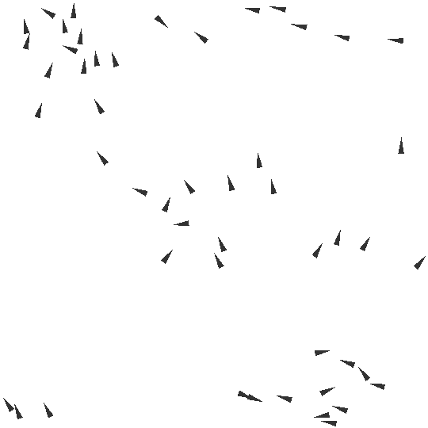

# Flocking Behavior

## Background

A simple flocking behavior simulation implemented in Taichi. Heavily inspired by [this tutorial](https://www.youtube.com/watch?v=mhjuuHl6qHM).

## Demo

- 50 Boids



- 5000 boids


## 运行方式

```bash
python3 main.py
```

## TODOS

- [x] Brute force implementation
- [x] OOP
- [ ] Quadtree optimization
